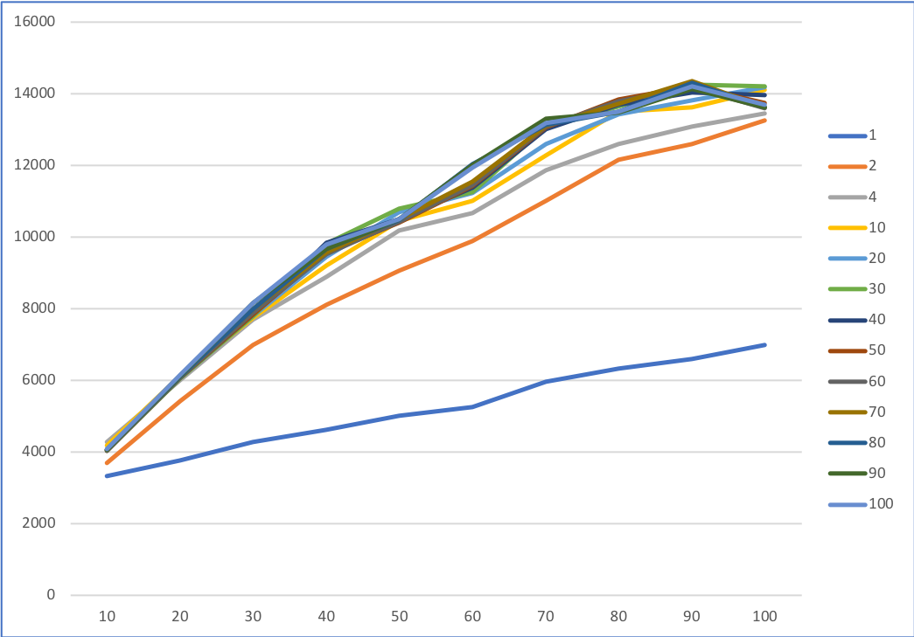

# INF-1101 - fei003 - a1: CONCURRENT B+TREES

This report details the implementation of concurrency control for a B+ Tree.

## 1. Introduction

When designing "concurrent" data structures (i.e., to be accessed from multiple threads),
they either have to be immutable so that no synchronization is needed, or they have to be implemented to ensure that that all changes to the data are accurately synchronized between all threads so that no data is lost or corrupted.

## 2. Implementation requirements and limitations

Imeplement a concurrency control that will enable concurrent search, insert, and delete operations within the B+tree implementation given in the precode. The multi-threaded benchmark and a correctness test was provided in the precode.

## 3. Implementation

Concurreny control was implemented by using the available read/write locks in the `pthread.h` library. More specifically, the `pthread_rwlock_wrlock()` and `pthread_rwlock_rdlock()` functions.

The locks are used to guarantee exclusive entry to the B+ tree operations `insert` and `delete`. `pthread_rwlock_wrlock()` is applied where multiple threads tries insert or update the data, and `pthread_rwlock_rdlock()` is used where read operations are done.

The `pthread_rwlock_wrlock()` works by acquiring an exclusive write lock on the write/read lock (input parameter), this means that if no threads are allowed to hold a shared read lock nor a exclusive write lock.

See the "master" insertion function and "master" deletion function for code.

## 4. Discussion

After running some benchmarks on a Windows machine with `32GB RAM, 4.8 GHz Intel i7 Skylake processor`  the following results were produced:

Where the Y-axis is the average time used, X-axis is the update ratio and the legend on the right is the number of threads.

As depicted in the graph, there is little to no difference in using one or hundred threads when doing mostly read operations (`-u 10`). Comparing the end case yields the same analogy (i.e., `-u 100`).

## 5. Conclusion

Although the aspect of keeping the data integrity under concurrent operations, the benckmarks tests showed no performance boost when using multiple threads. Using r/w locks when trying to achieve concurrency control works fine if you are mostly accessing the data for read operations.